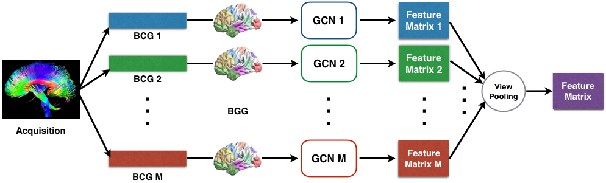
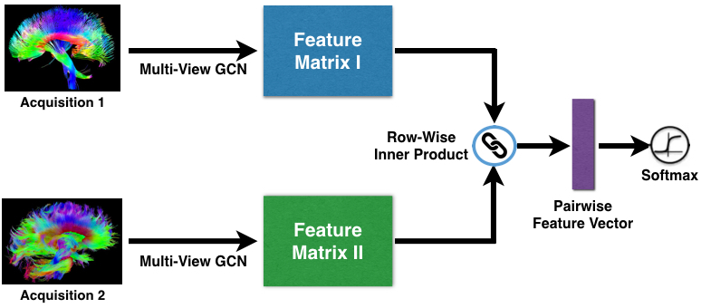

# Multi-View GCN (MVGCN) for Brain Networks

## Overview
<p align="center"></p>

This repository contains TensorFlow code for implementing Multi-View Graph Convolutional Network for brain networks (DTI data). To do this, we train models using graph convolutional networks (GCNs) in multiple views to learn view-based feature representations. Then, view pooling is conducted for the purpose of multi-view feature fusion. The code is documented and should be easy to modify for your own applications.      

## Model
The objective function is established for a binary classification problem, which is matching vs. non-matching classes. Brain networks in the same group (Parkinson's Disease or Healthy Control) are labeled as matching pairs while brain networks from different groups are labeled as non-matching pairs. Hence, pairwise training samples are feed into the neural network. The figure depicts the pairwise learning architecture.  

<p align="center"></p>

* The components utilized in the MVGCN are:
    * GCNs: incorporating coordinates of ROI (Region of Interest) with brain networks (DTI) together to learn interpretable representations.  
    * View pooling: combining view-based representations of DTI data that are obtained from various tractography algorithms.  
    * Pairwise matching: computing similarities by euclidean distance for sample pairs in terms of the pooled features.  
    * Softmax: classifying the output of pairwise matching layer into the matching vs. non-matching classes.
    
This repository contains the [slides](https://github.com/sheryl-ai/MVGCN/blob/master/slides.pdf) we presented in AMIA 2018.

## Requirements
This package has the following requirements:
* An NVIDIA GPU.
* `Python 3.x`
* [TensorFlow 1.4](https://github.com/tensorflow/tensorflow)

## Usage
### How to Run
To run MVGCN on your data, you need to: change the function of loading data in utils.py; define the names of multiple views in mvgcn.sh; set hyperparameters for MVGCN in mvgcn.sh; run the shell script mvgcn.sh
```bash
bash mvgcn.sh
```
### Data Format
The input file "dti.coo.pkl" is the XYZ-coordinate for given samples with the 3d dimension: n_samples x n_nodes x n_XYZ, where n_node equals to the number of ROI in our case. n_XYZ equals to 3 which indicates the X axis, Y axis, and Z axis. 

The input file "dti.pair.pkl" stores the index of samples and their corresponding labels by a tuple(pair, label), where pair is a list of pairwise indices. And label is a list of integer values. Here is an example with several sample pairs and labels: 

| Index 1   | Index 2   | Label       |  
|:---------:|:---------:|:-----------:|
|         0 |         8 |           1 | 
|         0 |         9 |           1 | 
|         0 |        10 |           1 |  
|         0 |        26 |           0 |  
|         1 |         5 |           0 | 
|         1 |         6 |           0 | 
|       ... |       ... |         ... | 

In detail, we use label 1 to indicate the sample pair belongs to the same class (matching) and label 0 to indicate it belongs to the different classes (non-matching). The index begins from 0. 

### Additional Material
There is implementations used in: 

Michaël Defferrard, Xavier Bresson, Pierre Vandergheynst, [Convolutional Neural Networks on Graphs with Fast Localized Spectral Filtering](https://arxiv.org/abs/1606.09375), Neural Information Processing Systems (NIPS), 2016.

Sofia Ira Ktena, Sarah Parisot, Enzo Ferrante, Martin Rajchl, Matthew Lee, Ben Glocker, Daniel Rueckert, [Distance Metric Learning using Graph Convolutional Networks: Application to Functional Brain Networks](https://arxiv.org/abs/1703.02161), Medical Image Computing and Computer-Assisted Interventions (MICCAI), 2017.


## References 
If you happen to use our work, please consider citing our paper: 
```
@inproceedings{zhang2018multi,
  title={Multi-view graph convolutional network and its applications on neuroimage analysis for parkinson’s disease},
  author={Zhang, Xi and He, Lifang and Chen, Kun and Luo, Yuan and Zhou, Jiayu and Wang, Fei},
  booktitle={AMIA Annual Symposium Proceedings},
  volume={2018},
  pages={1147},
  year={2018},
  organization={American Medical Informatics Association}
}
```
This paper can be accessed on : [Multi-View GCN] (https://arxiv.org/pdf/1805.08801.pdf)

## Acknowledgements 
We owe many thanks to [Dr. Liang Zhan](https://www.engineering.pitt.edu/People/Faculty/Profiles/Liang-Zhan/) for helping us on processing the neuroimages. Please see the paper for funding details and additional (non-code related) acknowledgements.
